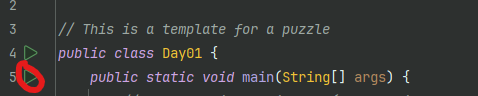

# advent-of-code-template (Kotlin)
Welcome to the Advent of Code template for the Kotlin language! Kotlin is a multiplatform, statically typed programming language, similar to Java.

## Prerequisites
This project runs Kotlin on the JVM platform, which is what Java normally runs on. To compile this project, you should install a JDK.
To do so, the easiest way is to run a prebuilt distribution installer. I recommend [Adoptium](https://adoptium.net/),
or [OpenJDK](https://jdk.java.net) if you want to manually install. Any Java version should be fine, since Gradle
(the tool this template uses to configure, compile and run the project) downloads an appropriate distribution for compilation anyway
(if it cannot detect one).

## Usage
1. Get your puzzle input, which you can download from the bottom of the puzzle webpage. You can also use an external tool, like [`advent-of-code-data`](https://github.com/wimglenn/advent-of-code-data) (aocd).
2. Put the puzzle input in the `inputs` directory. More information can be found in the [README there](inputs/README.md). 
3. Create a file in the `src/main/kotlin` directory, like `Day05.kt` for day 5. You can copy over the example code for day 1.
4. Solve the problem, write some code for it, and run it. The section below covers how running Kotlin code works.

## Running
Select your tool of preference below:

<details>
    <summary>IntelliJ Idea <b>(recommended)</b></summary>
    In IntelliJ Idea, you can run the code by simply clicking the green play button next to the main function:
    
</details>
<details>
    <summary>From the command line</summary>
If you are on a Unix-like system, make sure that `gradlew` is executable:
    
    chmod +x gradlew
    
Then run using:

    ./gradlew run --file DayxxKt

replacing the `xx` with the two-digit day number.
</details>
<details>
    <summary>Visual Studio Code with Kotlin plugin</summary>
    Click the Run button in the Debug tab or press F5, while having the file you want to run open.
    Do note that Visual Studio Code with the Kotlin Plugin is quite unstable.
</details>

## Directory structure
An overview of the directory structure:
```
advent-of-code-template
├── inputs
│   └── xx.txt              Puzzle input files for each day
│
├── src/main/kotlin
│   ├── Day01.kt            Template code for Day 1
│   ├── Inputs.kt           Contains some utility functions for loading puzzle inputs
│   └── Puzzle.kt           Wrapper for running your solution code
│
├── README.md               This file
├── build.gradle.kts        Gradle configuration (do not worry about it too much)
├── settings.gradle.kts     Gradle configuration
└── gradle/, gradlew        Gradle configuration/distribution
```
